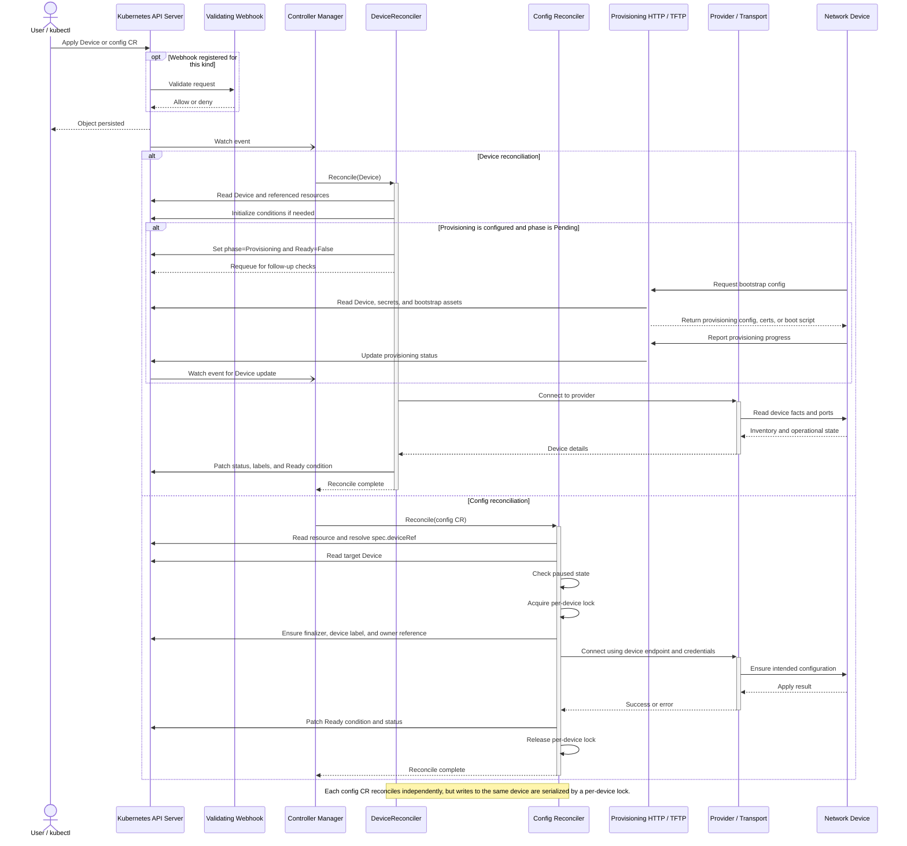
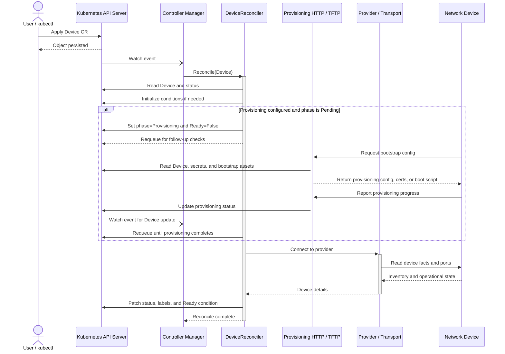
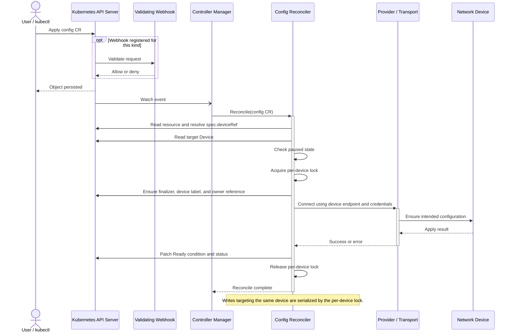

# Architecture Sequence Overview

This diagram shows the high-level runtime flow of the Network Operator.
It combines the two main paths in the project:

- `Device` lifecycle reconciliation, including optional provisioning.
- Per-resource configuration reconciliation for objects such as `Interface`, `BGP`, `VRF`, and `Certificate`.

## Reading Guide

- `Device` is the central resource. Other configuration resources target a device through `spec.deviceRef`.
- The admission webhook is optional and only runs for resource kinds that register validation webhooks.
- Provisioning and inline TFTP are optional manager-hosted services used during device bootstrap.
- After bootstrap, reconcilers connect through the provider and transport layer to push or verify device state.
- Status and conditions are always written back to Kubernetes so the API remains the source of truth.

## Device Provisioning Flow

This diagram focuses only on the `Device` lifecycle, including optional provisioning, progress checks, and the transition into the running state.

## Config Reconcile Flow

This diagram focuses on per-resource reconciliation for configuration CRs such as `Interface`, `BGP`, `VRF`, and `Certificate`.

