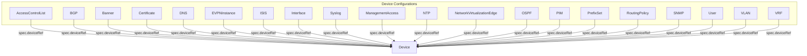

# Overview

The Network Operator is a Kubernetes-native solution for automating the provisioning and lifecycle management of network devices. It extends the Kubernetes API to provide a declarative, multi-vendor network automation, allowing you to manage your network infrastructure with the same tools and workflows you use for your applications. By representing network devices and their configurations as Kubernetes objects, the operator bridges the gap between your cloud-native environment and your networking hardware.

Users create Custom Resources such as `Device`, `Interface`, `BGP`, `VLAN`, and `VRF`. The operator reconciles those desired states, applies changes to real network devices through providers, and continuously reports device status back to Kubernetes.

## What This Operator Solves

- Declarative network management: replace manual or script-based device configuration with Kubernetes CRDs.
- Unified device state visibility: continuously sync device inventory and operational state back into Kubernetes.
- Vendor and protocol abstraction: hide device- and protocol-specific differences behind a provider interface.
- Built-in provisioning support: provide HTTP and TFTP services for device bootstrapping and initial provisioning.

## Core Concepts

- CRDs define intent.
- Controllers reconcile intent.
- Providers talk to devices.
- Status is continuously synced back.

## Main Building Blocks

- API (CRDs): `Device`, `Interface`, `BGP`, `VLAN`, `VRF`
- Controllers: reconcile desired vs actual state
- Providers: abstract vendor and protocol differences
- Provisioning services: embedded HTTP + TFTP

For the execution flow and sequence-level behavior, see [Architecture Sequence Overview](../architecture-overview).

## Architecture

The Network Operator follows a modular, controller-based architecture. At its core is the `Device` custom resource (CR), which represents a single network device. All other network configuration resources, such as interfaces, routing protocols, and ACLs, reference a `Device` to specify which piece of hardware they apply to.

This design allows for a clear separation of concerns and a composable approach to network configuration. The operator's provider system enables support for multiple vendors (like Cisco NX-OS and Arista EOS) through a common API.

Here’s a visual representation of the relationship between the primary Kubernetes resources managed by the Network Operator:

```mermaid
graph TD
    direction LR

    subgraph "Device Configurations"
        direction TB

        ACL[AccessControlList]
        BGP[BGP]
        Banner[Banner]
        Cert[Certificate]
        DNS[DNS]
        EVI[EVPNInstance]
        ISIS[ISIS]
        Int[Interface]
        Log[Syslog]
        MA[ManagementAccess]
        NTP[NTP]
        NVE[NetworkVirtualizationEdge]
        OSPF[OSPF]
        PIM[PIM]
        PS[PrefixSet]
        RP[RoutingPolicy]
        SNMP[SNMP]
        User[User]
        VLAN[VLAN]
        VRF[VRF]
    end

    D[Device]

    ACL -- spec.deviceRef --> D
    BGP -- spec.deviceRef --> D
    Banner -- spec.deviceRef --> D
    Cert -- spec.deviceRef --> D
    DNS -- spec.deviceRef --> D
    EVI -- spec.deviceRef --> D
    ISIS -- spec.deviceRef --> D
    Int -- spec.deviceRef --> D
    Log -- spec.deviceRef --> D
    MA -- spec.deviceRef --> D
    NTP -- spec.deviceRef --> D
    NVE -- spec.deviceRef --> D
    OSPF -- spec.deviceRef --> D
    PIM -- spec.deviceRef --> D
    PS -- spec.deviceRef --> D
    RP -- spec.deviceRef --> D
    SNMP -- spec.deviceRef --> D
    User -- spec.deviceRef --> D
    VLAN -- spec.deviceRef --> D
    VRF -- spec.deviceRef --> D
```
